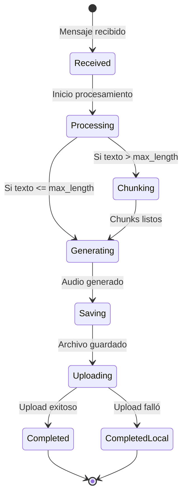

# 📚 API Reference

## 🎯 Interfaces Principales

### AudioGenerator

```python
from abc import ABC, abstractmethod
from typing import Tuple, List

class AudioGenerator(ABC):
    """Interface para generadores de audio"""
    
    @abstractmethod
    async def generate(self, text: str, language: str = "en") -> Tuple[str, str]:
        """
        Genera audio a partir de texto
        
        Args:
            text: Texto a convertir en audio
            language: Código de idioma ISO 639-1 (es, en, pt)
            
        Returns:
            Tuple[str, str]: (file_path, audio_id)
            
        Raises:
            AudioGenerationError: Si falla la generación
        """
        pass
    
    @abstractmethod
    async def generate_chunked(self, chunks: List[str], language: str = "en") -> Tuple[str, str]:
        """
        Genera audio a partir de múltiples chunks
        
        Args:
            chunks: Lista de textos a convertir
            language: Código de idioma
            
        Returns:
            Tuple[str, str]: (file_path, audio_id) del audio concatenado
        """
        pass
```

### MessageQueue

```python
class MessageQueue(ABC):
    """Interface para sistemas de mensajería"""
    
    @abstractmethod
    async def connect(self) -> None:
        """Establece conexión con el broker"""
        pass
    
    @abstractmethod
    async def consume(self, callback: Callable[[Dict[str, Any]], None]) -> None:
        """
        Consume mensajes de la cola
        
        Args:
            callback: Función a ejecutar por cada mensaje
        """
        pass
    
    @abstractmethod
    async def acknowledge(self, message_id: str) -> None:
        """Confirma procesamiento exitoso del mensaje"""
        pass
```

### FileStorage

```python
class FileStorage(ABC):
    """Interface para almacenamiento de archivos"""
    
    @abstractmethod
    async def save(self, file_path: str, content: bytes) -> str:
        """
        Guarda un archivo
        
        Args:
            file_path: Ruta donde guardar
            content: Contenido del archivo
            
        Returns:
            str: Ruta final del archivo guardado
        """
        pass
    
    @abstractmethod
    async def save_metadata(self, id: str, metadata: Dict[str, Any]) -> None:
        """Guarda metadata asociada a un ID"""
        pass
```

### AudioUploader

```python
class AudioUploader(ABC):
    """Interface para upload de archivos"""
    
    @abstractmethod
    async def upload(
        self, 
        file_path: str, 
        speech_id: str, 
        audio_type: str = "main",
        metadata: Optional[Dict[str, Any]] = None,
        original_text: Optional[str] = None
    ) -> Optional[Dict[str, Any]]:
        """
        Sube un archivo de audio
        
        Args:
            file_path: Ruta del archivo
            speech_id: ID del speech
            audio_type: Tipo (main, word, sentence, custom)
            metadata: Metadata adicional
            original_text: Texto original (requerido para /audio/speech/upload)
            
        Returns:
            Dict con respuesta del servidor o None si falla
        """
        pass
```

## 📦 Entidades de Dominio

### Speech

```python
@dataclass
class Speech:
    """Representa un speech en el sistema"""
    
    # Campos obligatorios
    id: str
    user_id: str
    name: str
    language: str
    original_text: str
    created_at: datetime
    
    # Campos opcionales
    project_id: Optional[str] = None
    status: str = "pending"
    speed: float = 1.0
    
    # Métodos
    def validate(self) -> bool:
        """Valida la entidad"""
    
    def should_chunk(self, max_length: int) -> bool:
        """Determina si necesita chunking"""
    
    @property
    def text_length(self) -> int:
        """Longitud del texto"""
```

### Audio

```python
@dataclass
class Audio:
    """Representa un audio generado"""
    
    # Campos principales
    id: str
    speech_id: str
    file_path: str
    file_size: int
    
    # Metadata
    duration: Optional[float] = None
    sample_rate: Optional[int] = None
    was_chunked: bool = False
    chunks_count: int = 1
    created_at: datetime = field(default_factory=datetime.now)
    
    # Estado de upload
    upload_status: str = "pending"  # pending, uploaded, failed
    upload_url: Optional[str] = None
    
    # Métodos
    def mark_as_uploaded(self, url: str) -> None:
        """Marca como subido exitosamente"""
    
    def mark_upload_failed(self) -> None:
        """Marca upload como fallido"""
```

## 🎭 Casos de Uso

### ProcessSpeechMessageUseCase

```python
class ProcessSpeechMessageUseCase:
    """Procesa mensajes de speech desde RabbitMQ"""
    
    def __init__(
        self,
        audio_generator: AudioGenerator,
        text_chunker: TextChunker,
        file_storage: FileStorage,
        audio_uploader: Optional[AudioUploader] = None,
        max_chunk_length: int = 566
    ):
        """Inicializa con dependencias"""
    
    async def execute(self, message: Dict[str, Any]) -> ProcessingResult:
        """
        Ejecuta el procesamiento completo
        
        Args:
            message: Mensaje de RabbitMQ
            
        Returns:
            ProcessingResult con estado y detalles
        """
```

### ProcessingResult

```python
@dataclass
class ProcessingResult:
    """Resultado del procesamiento"""
    
    success: bool
    audio_id: Optional[str] = None
    file_path: Optional[str] = None
    upload_url: Optional[str] = None
    error: Optional[str] = None
    processing_time: Optional[float] = None
```

## 🔧 Servicios

### AudioService

```python
class AudioService:
    """Servicio de dominio para audio"""
    
    async def validate_audio_file(self, file_path: str) -> bool:
        """Valida un archivo de audio"""
    
    async def get_audio_duration(self, file_path: str) -> Optional[float]:
        """Obtiene duración en segundos"""
    
    def estimate_processing_time(self, text_length: int) -> float:
        """Estima tiempo de procesamiento"""
```

### MetadataService

```python
class MetadataService:
    """Servicio para gestión de metadata"""
    
    async def add_processing_info(
        self, 
        audio_id: str, 
        processing_info: Dict[str, Any]
    ) -> None:
        """Agrega info de procesamiento"""
    
    async def get_statistics(
        self, 
        user_id: Optional[str] = None
    ) -> Dict[str, Any]:
        """Obtiene estadísticas agregadas"""
```

## 📝 Tipos de Datos

### Mensaje RabbitMQ

```json
{
  "id": "550e8400-e29b-41d4-a716-446655440000",
  "type": "speech.created",
  "timestamp": "2024-01-15T10:30:00.000Z",
  "retryCount": 0,
  "data": {
    "speechId": "123e4567-e89b-12d3-a456-426614174000",
    "userId": "user-uuid",
    "speechDto": {
      "uuid": "123e4567-e89b-12d3-a456-426614174000",
      "name": "Mi speech",
      "language": "es",
      "original_text": "Texto a convertir...",
      "project_id": "project-uuid",
      "speed": 1.0,
      "user_uuid": "user-uuid",
      "status": "pending",
      "created_at": "2024-01-15T10:30:00.000Z"
    }
  }
}
```

### Configuración (Settings)

```python
# Ejemplo de uso
from src.config import get_settings

settings = get_settings()

# Acceder a configuración
print(settings.rabbitmq.host)
print(settings.audio.output_dir)
print(settings.upload.enabled)

# Validación automática con Pydantic
# Si falta RABBITMQ_PASSWORD en .env, lanza error
```

## 🧩 Extensión

### Crear Nueva Implementación

```python
# src/infrastructure/audio/mi_generador.py
from src.application.interfaces import AudioGenerator

class MiGeneradorAudio(AudioGenerator):
    async def generate(self, text: str, language: str) -> Tuple[str, str]:
        # Tu implementación
        audio_id = str(uuid.uuid4())
        file_path = f"output/{audio_id}.wav"
        
        # Generar audio...
        
        return file_path, audio_id
```

### Registrar en Container

```python
# src/container.py
audio_generator = providers.Selector(
    config.audio.generator_type,
    higgs=providers.Singleton(HiggsAudioGenerator, ...),
    custom=providers.Singleton(MiGeneradorAudio, ...)
)
```

## 🔄 Ciclo de Vida



## ⚠️ Excepciones

```python
# Excepciones personalizadas
class AudioGenerationError(Exception):
    """Error al generar audio"""

class StorageError(Exception):
    """Error al guardar archivo"""

class UploadError(Exception):
    """Error al subir archivo"""

# Manejo
try:
    result = await use_case.execute(message)
except AudioGenerationError as e:
    logger.error(f"Audio generation failed: {e}")
except Exception as e:
    logger.error(f"Unexpected error: {e}")
```