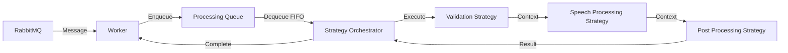

# 🏗️ Arquitectura del Sistema

## Visión General

Este servicio sigue una **Arquitectura Limpia** con principios **SOLID** y **Domain-Driven Design (DDD)**.

```
┌─────────────────────────────────────────────────────────────┐
│                      Presentation Layer                      │
│                   (Workers, CLI, API)                        │
├─────────────────────────────────────────────────────────────┤
│                     Application Layer                        │
│              (Use Cases, Services, DTOs)                     │
├─────────────────────────────────────────────────────────────┤
│                       Domain Layer                           │
│              (Entities, Value Objects, Rules)                │
├─────────────────────────────────────────────────────────────┤
│                   Infrastructure Layer                       │
│        (Database, Message Queue, External APIs)              │
└─────────────────────────────────────────────────────────────┘
```

## 📁 Estructura de Carpetas

```
src/
├── config/                 # Configuración de la aplicación
│   └── settings.py        # Pydantic settings con validación
│
├── domain/                 # Núcleo del negocio (sin dependencias)
│   ├── entities/          # Entidades del dominio
│   │   ├── speech.py      # Entidad Speech
│   │   ├── audio.py       # Entidad Audio
│   │   └── message.py     # Entidad Message
│   └── value_objects/     # Objetos de valor inmutables
│       └── audio_id.py    # Value Object para IDs
│
├── application/            # Lógica de aplicación
│   ├── interfaces/        # Contratos/Puertos
│   │   ├── message_queue.py
│   │   ├── audio_generator.py
│   │   ├── file_storage.py
│   │   ├── message_processing_strategy.py  # Nueva interfaz Strategy
│   │   └── processing_queue.py            # Nueva interfaz Queue
│   ├── strategies/        # Implementaciones de estrategias
│   │   ├── validation_strategy.py
│   │   ├── speech_processing_strategy.py
│   │   └── post_processing_strategy.py
│   ├── orchestrator/      # Coordinador de estrategias
│   │   └── strategy_orchestrator.py
│   ├── use_cases/         # Casos de uso del negocio
│   │   └── process_speech_message.py
│   └── services/          # Servicios de dominio
│       └── audio_service.py
│
├── infrastructure/         # Implementaciones concretas
│   ├── messaging/         # RabbitMQ, Kafka, etc.
│   ├── audio/            # Generadores de audio
│   ├── storage/          # File system, S3, etc.
│   ├── external/         # APIs externas
│   └── queues/           # Implementaciones de colas
│       └── in_memory_processing_queue.py
│
├── workers/              # Workers mejorados
│   └── message_consumer_worker.py  # Con cola interna y strategies
│
├── container.py          # Inyección de dependencias
└── main.py              # Punto de entrada
```

## 🔄 Flujo de Datos

Ver [COMPONENT_FLOW.md](./COMPONENT_FLOW.md) para diagramas detallados del flujo de componentes.

### Arquitectura con Patrón Strategy



Ver [STRATEGY_PATTERN.md](./STRATEGY_PATTERN.md) para detalles sobre la implementación del patrón Strategy.

## 🎯 Principios de Diseño

### 1. **Separación de Responsabilidades**
Cada capa tiene una responsabilidad específica:
- **Domain**: Lógica de negocio pura
- **Application**: Orquestación de casos de uso
- **Infrastructure**: Detalles de implementación
- **Presentation**: Interacción con el exterior

### 2. **Inversión de Dependencias**
```python
# ❌ Mal - Dependencia directa
class UseCase:
    def __init__(self):
        self.generator = HiggsAudioGenerator()  # Acoplado

# ✅ Bien - Dependencia invertida
class UseCase:
    def __init__(self, generator: AudioGenerator):
        self.generator = generator  # Desacoplado
```

### 3. **Inyección de Dependencias**
Usamos `dependency-injector` para gestionar dependencias:

```python
# container.py
audio_generator = providers.Singleton(
    HiggsAudioGenerator,
    config=config.audio
)

use_case = providers.Factory(
    ProcessSpeechMessageUseCase,
    audio_generator=audio_generator
)
```

## 🔌 Interfaces (Puertos)

Las interfaces definen contratos que deben cumplir las implementaciones:

```python
# application/interfaces/audio_generator.py
class AudioGenerator(ABC):
    @abstractmethod
    async def generate(self, text: str, language: str) -> Tuple[str, str]:
        """Genera audio desde texto"""
        pass
```

## 🏭 Implementaciones (Adaptadores)

Las implementaciones concretas viven en `infrastructure/`:

```python
# infrastructure/audio/higgs_audio_generator.py
class HiggsAudioGenerator(AudioGenerator):
    async def generate(self, text: str, language: str) -> Tuple[str, str]:
        # Implementación específica de Higgs
        pass
```

## 🧩 Casos de Uso

Los casos de uso orquestan la lógica de negocio:

```python
# application/use_cases/process_speech_message.py
class ProcessSpeechMessageUseCase:
    def __init__(self, audio_generator: AudioGenerator, ...):
        # Recibe interfaces, no implementaciones
        
    async def execute(self, message: Dict) -> ProcessingResult:
        # 1. Validar entrada
        # 2. Crear entidades
        # 3. Aplicar lógica de negocio
        # 4. Llamar servicios externos
        # 5. Retornar resultado
```

## 🔧 Configuración

Toda la configuración se centraliza en `config/settings.py`:

```python
class Settings(BaseSettings):
    app_name: str = "higgs-audio-service"
    rabbitmq: RabbitMQSettings
    audio: AudioSettings
    upload: UploadSettings
    
    class Config:
        env_file = ".env"
```

## 📊 Diagrama de Componentes

```
┌─────────────┐     ┌─────────────┐     ┌─────────────┐
│   Worker    │────▶│  Use Case   │────▶│   Domain    │
└─────────────┘     └─────────────┘     └─────────────┘
                            │
                            ▼
                    ┌─────────────┐
                    │ Interfaces  │
                    └─────────────┘
                            │
        ┌───────────────────┼───────────────────┐
        ▼                   ▼                   ▼
┌─────────────┐     ┌─────────────┐     ┌─────────────┐
│Audio Generator│   │File Storage │     │HTTP Uploader│
└─────────────┘     └─────────────┘     └─────────────┘
```

## 🚀 Extensibilidad

Para agregar nuevas funcionalidades:

1. **Nueva fuente de mensajes**: Implementa `MessageQueue`
2. **Nuevo generador de audio**: Implementa `AudioGenerator`
3. **Nuevo almacenamiento**: Implementa `FileStorage`
4. **Nueva estrategia de procesamiento**: Implementa `MessageProcessingStrategy`
5. **Nueva cola de procesamiento**: Implementa `ProcessingQueue`
6. **Nuevo caso de uso**: Crea en `application/use_cases/`

### Ejemplo: Agregar Nueva Estrategia

```python
# 1. Crear estrategia en application/strategies/
class CustomStrategy(MessageProcessingStrategy):
    @property
    def order(self) -> int:
        return 150  # Entre speech y post-processing

# 2. Registrar en container.py
custom_strategy = providers.Factory(CustomStrategy)

# 3. Agregar al orchestrator
strategies=providers.List(
    validation_strategy,
    speech_processing_strategy,
    custom_strategy,  # Nueva
    post_processing_strategy
)
```

No necesitas modificar código existente, solo agregar nuevas implementaciones.