# Flujo de Componentes - Higgs Audio Service

Este documento describe el flujo de componentes y la comunicación entre los diferentes módulos del sistema con el patrón Strategy implementado.

## Diagrama de Flujo Principal con Patrón Strategy

```mermaid
graph TB
    %% External Systems
    RMQ[RabbitMQ<br/>rabbit.oscgre.com:5672]
    API[API Server<br/>localhost:3000]
    
    %% Entry Points
    MAIN[main.py<br/>Entry Point]
    
    %% Workers & Queue
    WORKER[MessageConsumerWorker<br/>Message Processing Orchestrator]
    QUEUE[InMemoryProcessingQueue<br/>FIFO Queue with Priority]
    
    %% Strategy Pattern Components
    ORCHESTRATOR[StrategyOrchestrator<br/>Strategy Coordinator]
    VAL_STRATEGY[ValidationStrategy<br/>Order: 10]
    SPEECH_STRATEGY[SpeechProcessingStrategy<br/>Order: 100]
    TRANS_STRATEGY[TranscriptionProcessingStrategy<br/>Order: 150]
    POST_STRATEGY[PostProcessingStrategy<br/>Order: 200]
    WORD_STRATEGY[WordProcessingStrategy<br/>Order: 250]
    
    %% Infrastructure Layer
    RMQC[RabbitMQConsumer<br/>Message Queue Consumer]
    HIGGS[HiggsAudioGenerator<br/>TTS Engine MPS/CUDA/CPU]
    CHUNKER[SimpleTextChunker<br/>Text Splitter]
    STORAGE[LocalFileStorage<br/>File & Metadata]
    UPLOADER[HttpAudioUploader<br/>HTTP Client]
    VOICEREF[VoiceReferenceService<br/>Character Voice Manager]
    WHISPERX[WhisperXTranscriptionService<br/>Word-level Transcription]
    AUTH[HttpAuthService<br/>Authentication Service]
    
    %% LLM Services (NEW)
    LLM[LLMService<br/>AI Language Model]
    PROMPT[PromptService<br/>Template Manager]
    
    %% Domain Entities
    MSG[Message Entity<br/>+ retry_count]
    SPEECH[Speech Entity]
    AUDIO[Audio Entity]
    
    %% Flow
    RMQ -->|AMQP| RMQC
    MAIN -->|Initializes| WORKER
    WORKER -->|Consumes| RMQC
    RMQC -->|Message| QUEUE
    QUEUE -->|Dequeue FIFO| WORKER
    WORKER -->|Process| ORCHESTRATOR
    
    %% Strategy Flow
    ORCHESTRATOR -->|1st| VAL_STRATEGY
    ORCHESTRATOR -->|2nd| SPEECH_STRATEGY
    ORCHESTRATOR -->|3rd| TRANS_STRATEGY
    ORCHESTRATOR -->|4th| POST_STRATEGY
    ORCHESTRATOR -->|5th| WORD_STRATEGY
    
    %% Speech Processing Strategy Flow
    SPEECH_STRATEGY -->|Extract| SPEECH
    SPEECH_STRATEGY -->|Get Voice| VOICEREF
    VOICEREF -->|Voice Path| SPEECH_STRATEGY
    SPEECH_STRATEGY -->|Check Length| CHUNKER
    SPEECH_STRATEGY -->|Generate| HIGGS
    HIGGS -->|WAV File| AUDIO
    HIGGS -->|Save| STORAGE
    
    %% Transcription Processing Strategy Flow
    TRANS_STRATEGY -->|Read Audio| AUDIO
    TRANS_STRATEGY -->|Transcribe| WHISPERX
    WHISPERX -->|Word-level SRT| TRANS_STRATEGY
    
    %% Post Processing Strategy Flow
    POST_STRATEGY -->|Check Transcription| POST_STRATEGY
    POST_STRATEGY -->|Upload with Word-level SRT| UPLOADER
    UPLOADER -->|Get Token| AUTH
    AUTH -->|Access Token| UPLOADER
    UPLOADER -->|HTTP POST| API
    
    %% Word Processing Strategy Flow
    WORD_STRATEGY -->|Extract Text| SPEECH
    WORD_STRATEGY -->|Split Words| WORD_STRATEGY
    WORD_STRATEGY -->|For Each Word| HIGGS
    WORD_STRATEGY -->|Generate Word Audio| AUDIO
    WORD_STRATEGY -->|Upload Each Word| UPLOADER
    UPLOADER -->|audio_type=word| WORD_URL
    
    %% LLM Integration (Available for all strategies)
    VAL_STRATEGY -.->|Future Use| LLM
    SPEECH_STRATEGY -.->|Future Use| LLM
    TRANS_STRATEGY -.->|Future Use| LLM
    POST_STRATEGY -.->|Future Use| LLM
    WORD_STRATEGY -.->|Future Use| LLM
    LLM -->|Get Templates| PROMPT
    
    %% Styling
    classDef external fill:#f9f,stroke:#333,stroke-width:2px
    classDef infra fill:#bbf,stroke:#333,stroke-width:2px
    classDef app fill:#bfb,stroke:#333,stroke-width:2px
    classDef strategy fill:#fbb,stroke:#333,stroke-width:3px
    classDef domain fill:#ffd,stroke:#333,stroke-width:2px
    classDef service fill:#fcf,stroke:#333,stroke-width:2px
    classDef llm fill:#9f9,stroke:#333,stroke-width:3px
    
    class RMQ,API external
    class RMQC,HIGGS,CHUNKER,STORAGE,UPLOADER,WHISPERX,AUTH infra
    class VOICEREF service
    class WORKER,QUEUE app
    class ORCHESTRATOR,VAL_STRATEGY,SPEECH_STRATEGY,TRANS_STRATEGY,POST_STRATEGY,WORD_STRATEGY strategy
    class MSG,SPEECH,AUDIO domain
    class LLM,PROMPT llm
```

## Flujo Detallado de Procesamiento con Patrón Strategy

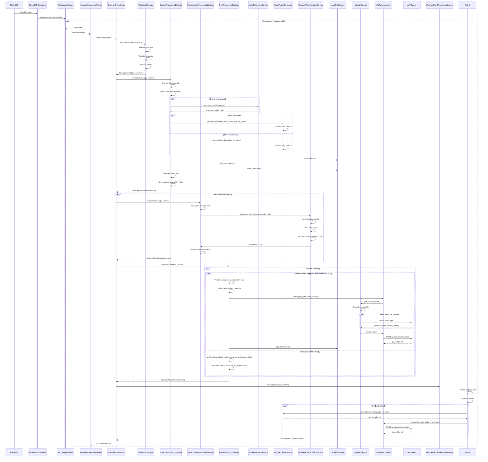

## Flujo de Datos de Mensaje

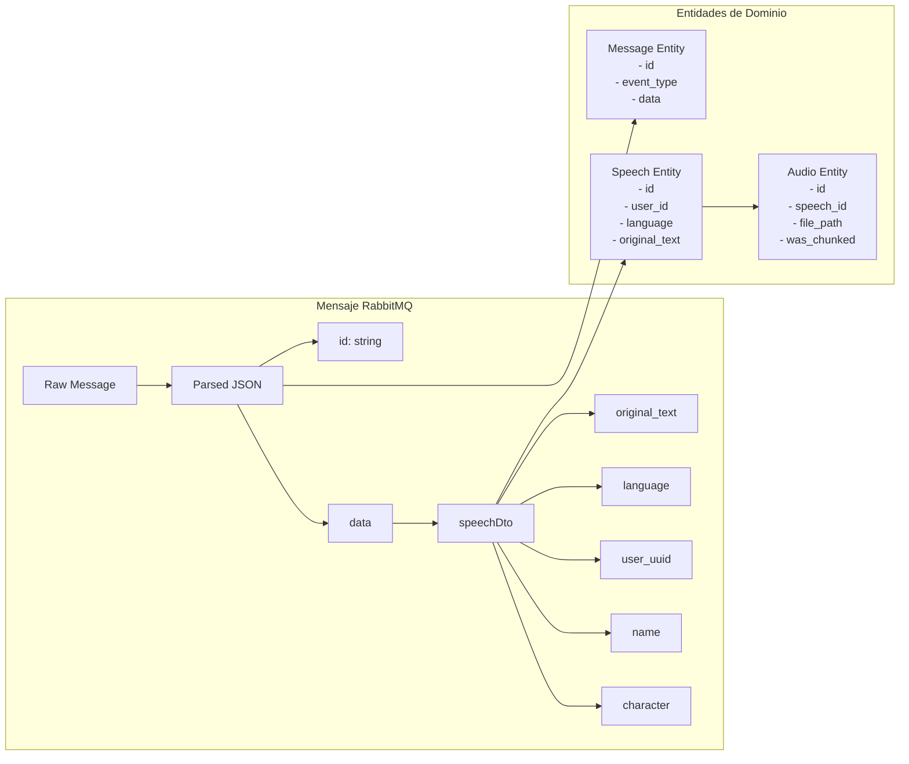

## Configuración de Upload Endpoints

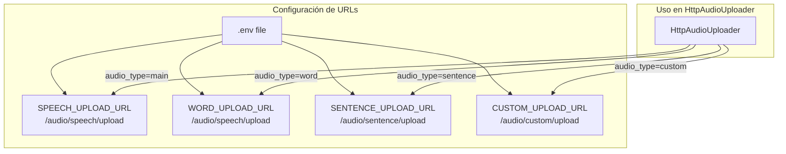

## Componentes Principales con Patrón Strategy

### 1. **main.py**
- Punto de entrada de la aplicación
- Configura el logging
- Inicializa el contenedor de dependencias con configuración extendida
- Crea y ejecuta el MessageConsumerWorker con procesadores concurrentes

### 2. **MessageConsumerWorker** (Mejorado)
- Separa consumo de RabbitMQ del procesamiento
- Maneja una cola interna FIFO con prioridades
- Ejecuta múltiples procesadores concurrentes (3 por defecto)
- Graceful shutdown con procesamiento de mensajes pendientes
- Estadísticas en tiempo real

### 3. **InMemoryProcessingQueue**
- Cola FIFO con soporte de prioridades (CRITICAL, HIGH, NORMAL, LOW)
- Thread-safe con asyncio
- Estadísticas de cola
- Soporte para requeue con reintentos

### 4. **StrategyOrchestrator**
- Coordina la ejecución de estrategias en orden
- Maneja contexto compartido entre estrategias
- Control de flujo (continuar, parar, saltar)
- Inicialización y limpieza de estrategias

### 5. **Estrategias Implementadas**

#### Orden de Ejecución de Estrategias

| Estrategia | Orden | Descripción |
|------------|-------|-------------|
| ValidationStrategy | 10 | Validación inicial del mensaje |
| SpeechProcessingStrategy | 100 | Generación del audio principal |
| TranscriptionProcessingStrategy | 150 | Transcripción palabra por palabra |
| PostProcessingStrategy | 200 | Upload del audio principal con SRT |
| WordProcessingStrategy | 250 | Procesamiento y upload palabra por palabra |

#### ValidationStrategy (Orden: 10)
- Valida estructura del mensaje
- Verifica campos requeridos
- Valida idiomas soportados
- Controles de seguridad
- Validación de longitud de texto

#### SpeechProcessingStrategy (Orden: 100)
- Refactorización de ProcessSpeechMessageUseCase
- Extrae datos del mensaje incluyendo campo 'character'
- Resuelve voz de referencia usando VoiceReferenceService
- Genera audio con timeout y voz específica
- Maneja chunking para textos largos
- Guarda metadata
- Genera SRT básico (no realiza upload)
- Marca context['uploaded'] = False

#### TranscriptionProcessingStrategy (Orden: 150)
- Transcripción automática del audio generado
- Usa WhisperX con Silero VAD para detección de voz
- Alineación palabra por palabra con wav2vec2.0
- Genera SRT con timestamps precisos por palabra
- Configurable: puede activarse/desactivarse
- No bloquea el flujo si falla

#### PostProcessingStrategy (Orden: 200)
- Upload SOLO cuando transcripción está completa
- Verifica transcription_completed y transcription_srt
- Si transcripción no está lista: skip upload con log "waiting for word-level transcription"
- Solo sube audio con SRT palabra por palabra (nunca con SRT básico)
- Notificaciones (configurable)
- Analytics (configurable)
- Limpieza de archivos temporales (configurable)

#### WordProcessingStrategy (Orden: 250)
- Procesa el texto original palabra por palabra
- Extrae original_text del contexto
- Divide el texto en palabras individuales
- Para cada palabra:
  - Genera audio usando HiggsAudioGenerator
  - Usa la misma voz de referencia del audio principal
  - Sube el audio con audio_type="word"
- Procesamiento concurrente con límite configurable
- Timeout por palabra configurable
- No bloquea el flujo si falla

### 6. **HiggsAudioGenerator** (Mejorado)
- Detección automática de dispositivo (MPS/CUDA/CPU)
- Generación asíncrona con thread pool
- Timeouts configurables
- Soporte para chunking y concatenación
- Soporte para audio de referencia (voice cloning)
- Integración con AudioContent para referencias de voz

### 7. **Configuración Extendida**
- ProcessingQueueSettings: max_size, concurrent_processors
- ValidationSettings: min/max_text_length
- PostProcessingSettings: notifications, analytics, cleanup, webhook
- TranscriptionSettings: enabled, model, device, compute_type, batch_size
- AuthSettings: url, email, password, token_refresh_margin
- LLMSettings: provider, base_url, api_key, model, temperature, max_tokens

## Flujo de Procesamiento Palabra por Palabra

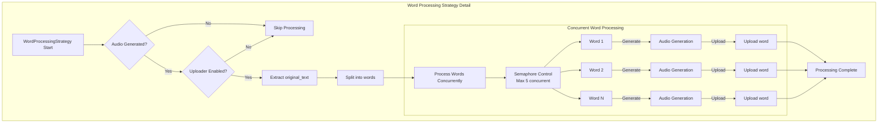

## Flujo de Upload con Transcripción

```mermaid
graph TD
    START[Audio Generado]
    CHECK_TRANS{¿Transcripción<br/>Completa?}
    CHECK_SRT{¿SRT Palabra<br/>por Palabra?}
    UPLOAD[Upload con SRT]
    SKIP[Skip Upload<br/>"waiting for transcription"]
    SUCCESS[Upload Exitoso]
    
    START --> CHECK_TRANS
    CHECK_TRANS -->|Sí| CHECK_SRT
    CHECK_TRANS -->|No| SKIP
    CHECK_SRT -->|Sí| UPLOAD
    CHECK_SRT -->|No| SKIP
    UPLOAD --> SUCCESS
```

## Flujo de Procesamiento de Palabras Detallado

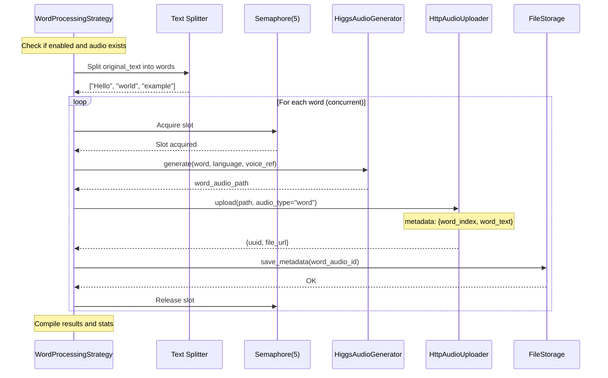

## Flujo de Error y Reintentos

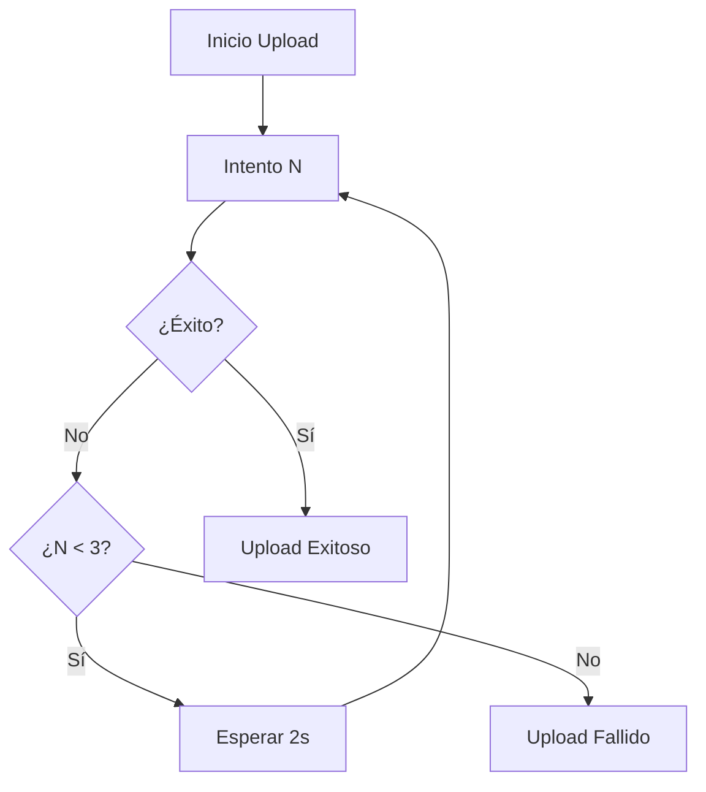

## Flujo de Prioridades y Control de Estrategias

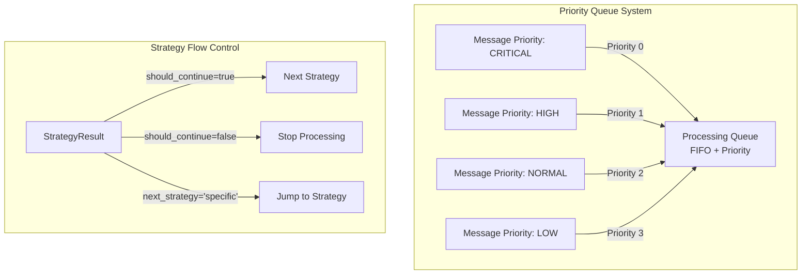

## Configuración de Variables de Entorno

```bash
# Processing Queue Configuration
QUEUE_MAX_SIZE=1000              # Tamaño máximo de la cola
CONCURRENT_PROCESSORS=3          # Procesadores concurrentes

# Validation Strategy Configuration
VALIDATION_MIN_TEXT_LENGTH=1     # Longitud mínima del texto
VALIDATION_MAX_TEXT_LENGTH=10000 # Longitud máxima del texto

# Post-Processing Strategy Configuration
ENABLE_NOTIFICATIONS=true        # Habilitar notificaciones
ENABLE_ANALYTICS=true           # Habilitar analytics
ENABLE_CLEANUP=false            # Habilitar limpieza
WEBHOOK_URL=                    # URL para webhooks

# Word Processing Strategy Configuration
WORD_PROCESSING_ENABLED=true         # Habilitar procesamiento por palabras
WORD_PROCESSING_MAX_CONCURRENT=5     # Máximo de palabras procesando concurrentemente
WORD_PROCESSING_TIMEOUT=30.0         # Timeout en segundos por palabra

# Audio Configuration
AUDIO_DEVICE=                   # Dispositivo (auto-detecta si vacío)

# Transcription Configuration
TRANSCRIPTION_ENABLED=true      # Habilitar transcripción WhisperX
TRANSCRIPTION_MODEL=base        # Modelo: tiny, base, small, medium, large
TRANSCRIPTION_DEVICE=cpu        # Dispositivo: cpu o cuda
TRANSCRIPTION_COMPUTE_TYPE=int8 # Precisión: float16, int8
TRANSCRIPTION_BATCH_SIZE=16     # Tamaño del batch

# Authentication Configuration
AUTH_URL=http://localhost:3000/auth/login  # URL del endpoint de autenticación
AUTH_EMAIL=admin@test.com                  # Email para autenticación
AUTH_PASSWORD=password123                  # Contraseña para autenticación
AUTH_TOKEN_REFRESH_MARGIN=300              # Segundos antes de expirar para renovar

# LLM Provider Configuration
LLM_PROVIDER=ollama                        # Proveedor LLM: ollama, claude, openai
LLM_BASE_URL=https://llm.oscgre.com        # URL base para API LLM
LLM_API_KEY=                               # API key para proveedores que lo requieren
LLM_MODEL=llama3.1                         # Modelo por defecto
LLM_TEMPERATURE=0.7                        # Temperatura para generación (0.0-1.0)
LLM_MAX_TOKENS=2000                        # Máximo de tokens a generar
LLM_TIMEOUT=30                             # Timeout en segundos para requests LLM

# Configuración específica por proveedor
OLLAMA_MODEL=llama3.1                      # Modelo de Ollama
CLAUDE_API_KEY=                            # API key de Claude
CLAUDE_MODEL=claude-3-opus-20240229        # Versión del modelo Claude
OPENAI_API_KEY=                            # API key de OpenAI
OPENAI_MODEL=gpt-4-turbo-preview           # Modelo de OpenAI
```

## Notas Importantes

1. **Patrón Strategy**: Permite agregar nuevas estrategias sin modificar código existente
2. **Cola con Prioridades**: Los mensajes críticos se procesan primero
3. **Procesamiento Concurrente**: 3 procesadores trabajan en paralelo por defecto
4. **Detección de GPU**: Automática para MPS (Apple), CUDA (NVIDIA) o CPU
5. **Timeouts**: 5 minutos por chunk para evitar bloqueos indefinidos
6. **Retry Count**: Los mensajes incluyen contador de reintentos
7. **Graceful Shutdown**: Procesa mensajes pendientes antes de cerrar
8. **Contexto Compartido**: Las estrategias pueden compartir datos entre sí
9. **Voice References**: Sistema centralizado de gestión de voces por personaje
10. **Upload Condicional**: El audio SOLO se sube cuando la transcripción palabra por palabra está completa
11. **No Duplicate Uploads**: SpeechProcessingStrategy ya no realiza uploads, todo se centraliza en PostProcessingStrategy
12. **Autenticación Automática**: HttpAuthService maneja login y renovación de tokens automáticamente

## Nuevos Componentes - Sistema de Transcripción

### WhisperXTranscriptionService
- Servicio de transcripción automática con alineación palabra por palabra
- Componentes principales:
  - **Whisper**: Modelo de reconocimiento de voz de OpenAI
  - **Silero VAD**: Voice Activity Detection para segmentación precisa
  - **wav2vec2.0**: Forced alignment para timestamps exactos por palabra
- Características:
  - Detección automática de idioma
  - Soporte para 20+ idiomas
  - Modelos disponibles: tiny, base, small, medium, large
  - Procesamiento en CPU o GPU
  - Genera SRT con timestamp individual para cada palabra

## Sistema de Autenticación

### HttpAuthService
- Servicio de autenticación HTTP para gestión de tokens
- Características principales:
  - **Login automático**: Se autentica con las credenciales configuradas
  - **Caché de tokens**: Mantiene tokens en memoria para evitar múltiples logins
  - **Renovación automática**: Renueva tokens antes de que expiren
  - **Thread-safe**: Uso de locks para evitar autenticaciones simultáneas
- Flujo de autenticación:
  1. HttpAudioUploader solicita token antes de cada upload
  2. HttpAuthService verifica si el token actual es válido
  3. Si no es válido o está por expirar, realiza login automático
  4. Retorna el token válido para el upload

### Flujo de Transcripción

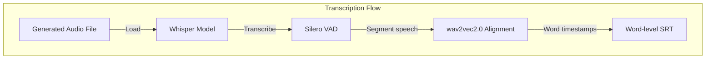

## Sistema de Referencias de Voz

### VoiceReferenceService
- Servicio que gestiona un conjunto de voces predefinidas
- Mapeo de nombres de personajes a archivos de audio de referencia
- Voces disponibles:
  - **belinda** (default): Voz profesional femenina clara
  - **shrek_donkey**: Voz energética en español
  - **narrator**: Voz profunda para audiolibros
  - **child**: Voz juvenil entusiasta
  - **elder**: Voz sabia y cálida
- Fallback automático a voz por defecto si no se encuentra el personaje

### Flujo de Selección de Voz

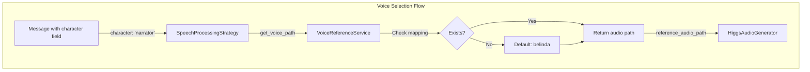

## Flujo de Autenticación

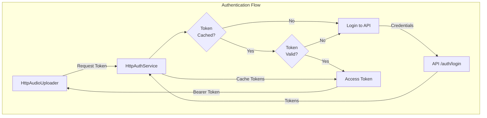

## Sistema de Language Models (LLM) - NUEVO

### LLMService
- Servicio principal para interacción con modelos de lenguaje
- Soporta múltiples proveedores mediante patrón Factory
- Proveedores implementados:
  - **Ollama**: Configurado por defecto con https://llm.oscgre.com
  - **Claude**: API de Anthropic
  - **OpenAI**: API de OpenAI
- Características:
  - Generación de texto con y sin plantillas
  - Streaming de respuestas
  - Configuración por variables de entorno
  - Selección dinámica de proveedor

### PromptService
- Gestión centralizada de plantillas de prompts
- Categorías disponibles:
  - **transcription**: Mejora y corrección de transcripciones
  - **translation**: Traducción de textos
  - **summarization**: Resumen de contenido
  - **analysis**: Análisis de sentimientos y temas
  - **generation**: Generación de títulos y descripciones
  - **validation**: Validación de calidad y moderación
  - **custom**: Plantillas personalizables
- Sistema de renderizado con variables
- 13 plantillas predefinidas listas para usar

### Flujo de Integración LLM

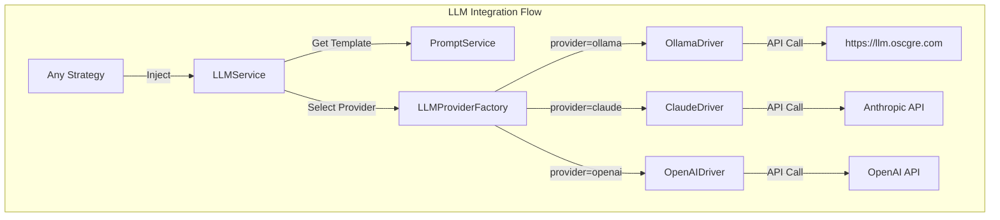

### Uso del Servicio LLM

Las estrategias pueden inyectar el servicio LLM cuando lo necesiten:

```python
# Ejemplo de uso en una estrategia
async def execute(self, message, context):
    # Usar con plantilla predefinida
    response = await self.llm_service.generate_with_template(
        "enhance_transcription",
        {"transcription": context["transcription"]}
    )
    
    # Usar directamente
    response = await self.llm_service.generate(
        prompt="Analiza el siguiente texto...",
        system_prompt="Eres un experto analista...",
        temperature=0.5
    )
```

## Referencias de Archivos

### Archivos de Configuración
- **src/main.py**: Punto de entrada principal
- **src/container.py**: Contenedor de inyección de dependencias
- **.env.example**: Plantilla de configuración

### Capa de Aplicación
- **src/application/interfaces/**
  - `voice_reference_service.py`: Interfaz del servicio de voces
  - `audio_generator.py`: Interfaz del generador de audio
  - `message_processing_strategy.py`: Interfaz base de estrategias
  - `transcription_service.py`: Interfaz del servicio de transcripción
  - `llm_service.py`: Interfaz del servicio LLM (NUEVO)
  - `prompt_service.py`: Interfaz del servicio de prompts (NUEVO)
- **src/application/strategies/**
  - `speech_processing_strategy.py`: Estrategia principal de procesamiento
  - `validation_strategy.py`: Estrategia de validación
  - `transcription_processing_strategy.py`: Estrategia de transcripción
  - `post_processing_strategy.py`: Estrategia de post-procesamiento
  - `word_processing_strategy.py`: Estrategia de procesamiento por palabras
- **src/application/orchestrator.py**: Coordinador de estrategias
- **src/application/utils/srt_generator.py**: Generador de SRT básico

### Capa de Infraestructura
- **src/infrastructure/services/**
  - `local_voice_reference_service.py`: Implementación del servicio de voces
- **src/infrastructure/transcription/**
  - `whisperx_transcription_service.py`: Implementación con WhisperX
- **src/infrastructure/audio/**
  - `higgs_audio_generator.py`: Implementación del generador Higgs
  - `simple_text_chunker.py`: Divisor de texto
- **src/infrastructure/messaging/**
  - `rabbitmq_consumer.py`: Consumidor de RabbitMQ
- **src/infrastructure/queues/**
  - `in_memory_processing_queue.py`: Cola de procesamiento en memoria
- **src/infrastructure/storage/**
  - `local_file_storage.py`: Almacenamiento local de archivos
- **src/infrastructure/external/**
  - `http_audio_uploader.py`: Cliente HTTP para uploads con SRT
  - `http_auth_service.py`: Servicio de autenticación HTTP
- **src/infrastructure/llm/** (NUEVO)
  - `base_driver.py`: Clase base para drivers LLM
  - `ollama_driver.py`: Driver para Ollama
  - `claude_driver.py`: Driver para Claude
  - `openai_driver.py`: Driver para OpenAI
  - `llm_provider_factory.py`: Factory para selección de proveedores
  - `llm_service_impl.py`: Implementación del servicio LLM
- **src/infrastructure/prompts/** (NUEVO)
  - `local_prompt_service.py`: Servicio de prompts con plantillas predefinidas

### Workers
- **src/workers/**
  - `message_consumer_worker.py`: Worker principal con procesamiento concurrente

### Dominio
- **src/domain/entities/**
  - `message.py`: Entidad Message
  - `speech.py`: Entidad Speech
  - `audio.py`: Entidad Audio

### Tests
- **test_voice_reference_service.py**: Test del servicio de voces
- **test_reference_audio.py**: Test de integración con audio de referencia
- **tests/unit/infrastructure/llm/** (NUEVO)
  - `test_prompt_service.py`: Tests del servicio de prompts
  - `test_llm_factory.py`: Tests del factory de proveedores
  - `test_llm_service.py`: Tests del servicio LLM