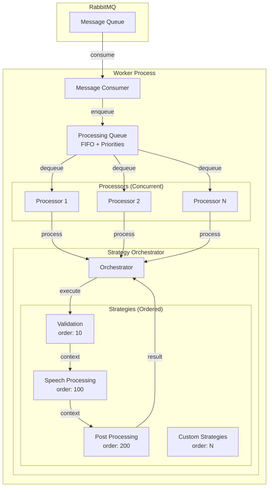

# 🎯 Patrón Strategy - Guía de Implementación

Este documento describe la implementación del patrón Strategy en el sistema Higgs Audio Service.

## Visión General

El patrón Strategy permite definir una familia de algoritmos, encapsular cada uno de ellos y hacerlos intercambiables. En nuestro sistema, cada estrategia representa una etapa del procesamiento de mensajes.

## Arquitectura del Sistema



## Componentes Principales

### 1. MessageProcessingStrategy (Interface)

```python
class MessageProcessingStrategy(ABC):
    @property
    @abstractmethod
    def name(self) -> str:
        """Nombre único de la estrategia"""
        pass
    
    @property
    @abstractmethod
    def order(self) -> int:
        """Orden de ejecución (menor = primero)"""
        pass
    
    @abstractmethod
    async def can_handle(self, message: Dict) -> bool:
        """Determina si puede procesar el mensaje"""
        pass
    
    @abstractmethod
    async def execute(self, message: Dict, context: Dict) -> StrategyResult:
        """Ejecuta la estrategia"""
        pass
```

### 2. ProcessingQueue

- **FIFO con Prioridades**: Mantiene el orden de llegada dentro de cada nivel de prioridad
- **Soporte para Reintentos**: Re-encola mensajes fallidos con menor prioridad
- **Estadísticas**: Tracking de mensajes procesados, fallidos, tiempo de espera

### 3. StrategyOrchestrator

- **Ejecución Ordenada**: Ejecuta estrategias según su propiedad `order`
- **Contexto Compartido**: Pasa datos entre estrategias
- **Control de Flujo**: Permite saltar o detener la cadena

## Estrategias Implementadas

### ValidationStrategy (order: 10)
```python
# Valida estructura y contenido del mensaje
# Ejecuta primero para evitar procesamiento costoso de mensajes inválidos
- Valida campos requeridos
- Verifica longitud de texto
- Detecta patrones peligrosos
- Enriquece contexto con estadísticas
```

### SpeechProcessingStrategy (order: 100)
```python
# Procesa el mensaje de speech (refactorizado del use case original)
- Genera audio con Higgs Engine
- Maneja chunking de texto largo
- Guarda archivos y metadata
- Sube audio si está habilitado
```

### PostProcessingStrategy (order: 200)
```python
# Acciones después del procesamiento principal
- Registra analytics
- Envía notificaciones
- Ejecuta webhooks
- Limpieza opcional
```

## Configuración

### Variables de Entorno

```bash
# Cola de Procesamiento
QUEUE_MAX_SIZE=1000              # Tamaño máximo de la cola (0 = ilimitado)
CONCURRENT_PROCESSORS=3          # Procesadores concurrentes

# Validación
VALIDATION_MIN_TEXT_LENGTH=1     # Longitud mínima del texto
VALIDATION_MAX_TEXT_LENGTH=10000 # Longitud máxima del texto

# Post-Procesamiento
ENABLE_NOTIFICATIONS=true        # Habilitar notificaciones
ENABLE_ANALYTICS=true           # Habilitar analytics
ENABLE_CLEANUP=false            # Habilitar limpieza
WEBHOOK_URL=                    # URL del webhook (opcional)
```

## Crear Nueva Estrategia

### 1. Implementar la Estrategia

```python
# src/application/strategies/my_custom_strategy.py
from ..interfaces import MessageProcessingStrategy, StrategyResult

class MyCustomStrategy(MessageProcessingStrategy):
    def __init__(self, my_service: MyService):
        self.my_service = my_service
    
    @property
    def name(self) -> str:
        return "my_custom_processing"
    
    @property
    def order(self) -> int:
        return 150  # Ejecuta entre speech y post-processing
    
    async def can_handle(self, message: Dict[str, Any]) -> bool:
        # Lógica para determinar si procesar
        return "my_field" in message.get("data", {})
    
    async def execute(self, message: Dict[str, Any], context: Dict[str, Any]) -> StrategyResult:
        try:
            # Tu lógica de procesamiento
            result = await self.my_service.process(message)
            
            # Actualizar contexto para siguientes estrategias
            context["my_result"] = result
            
            return StrategyResult(
                success=True,
                data={"processed": True, "result": result},
                should_continue=True  # Continuar con siguiente estrategia
            )
        except Exception as e:
            return StrategyResult(
                success=False,
                error=str(e),
                should_continue=False  # Detener cadena en caso de error
            )
```

### 2. Registrar en Container

```python
# src/container.py
my_custom_strategy = providers.Factory(
    MyCustomStrategy,
    my_service=my_service
)

strategy_orchestrator = providers.Factory(
    StrategyOrchestrator,
    strategies=providers.List(
        validation_strategy,
        speech_processing_strategy,
        my_custom_strategy,  # Nueva estrategia
        post_processing_strategy
    )
)
```

## Control de Flujo Avanzado

### Saltar a Estrategia Específica

```python
return StrategyResult(
    success=True,
    data={},
    next_strategy="post_processing"  # Saltar directamente a post-processing
)
```

### Detener Procesamiento

```python
return StrategyResult(
    success=False,
    error="Critical error",
    should_continue=False  # Detener cadena
)
```

### Procesamiento Condicional

```python
async def can_handle(self, message: Dict[str, Any]) -> bool:
    # Solo procesar mensajes de cierto tipo
    return message.get("type") == "special_message"
```

## Prioridades de Mensajes

El sistema soporta 4 niveles de prioridad:

1. **CRITICAL** (0): Máxima prioridad
2. **HIGH** (1): Alta prioridad
3. **NORMAL** (2): Prioridad por defecto
4. **LOW** (3): Baja prioridad (reintentos)

```python
# El worker determina automáticamente la prioridad
def _determine_priority(self, message: Message) -> MessagePriority:
    if message.retry_count > 0:
        return MessagePriority.LOW
    if "premium" in message.data.get("user_id", ""):
        return MessagePriority.HIGH
    return MessagePriority.NORMAL
```

## Monitoreo y Estadísticas

El sistema proporciona estadísticas en tiempo real:

```
=== Worker Statistics ===
Uptime: 300s
Messages received: 150
Messages processed: 145
Messages failed: 5
Queue size: 10
Queue stats: {
    'current_size': 10,
    'messages_by_priority': {'NORMAL': 8, 'LOW': 2},
    'avg_wait_time_seconds': 2.5
}
```

## Mejores Prácticas

1. **Orden de Estrategias**: 
   - Validación (10-50)
   - Pre-procesamiento (50-100)
   - Procesamiento principal (100-150)
   - Post-procesamiento (150-200)
   - Limpieza (200+)

2. **Manejo de Errores**:
   - Errores de validación: `should_continue=False`
   - Errores temporales: Permitir reintentos
   - Errores no críticos: `should_continue=True`

3. **Contexto Compartido**:
   - Usar prefijos para evitar colisiones: `context["my_strategy_result"]`
   - No modificar datos de otras estrategias
   - Documentar qué agrega cada estrategia al contexto

4. **Performance**:
   - Estrategias costosas deben ejecutar después de validación
   - Usar `can_handle()` para filtrar mensajes temprano
   - Considerar procesamiento asíncrono para tareas largas

## Troubleshooting

### Cola Llena
```
ERROR - Failed to enqueue message - queue might be full
```
**Solución**: Aumentar `QUEUE_MAX_SIZE` o agregar más procesadores

### Estrategia No Encontrada
```
WARNING - Unknown strategy requested: strategy_name
```
**Solución**: Verificar que la estrategia esté registrada en el container

### Timeout en Procesamiento
```
WARNING - Timeout: N messages still in queue
```
**Solución**: Aumentar `CONCURRENT_PROCESSORS` o optimizar estrategias lentas